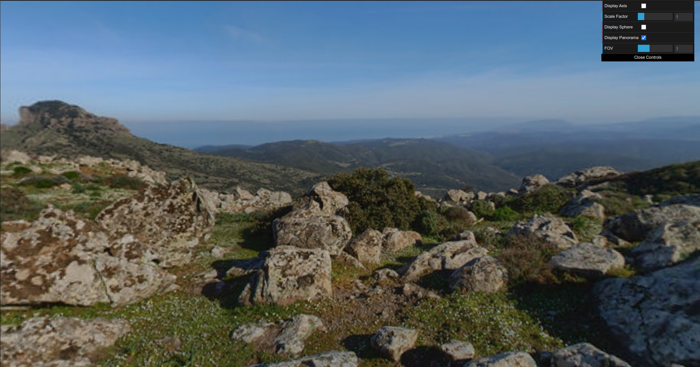
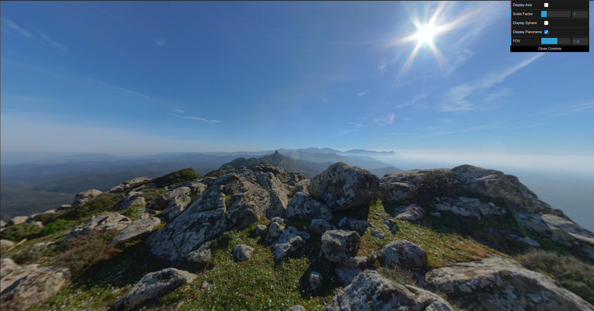
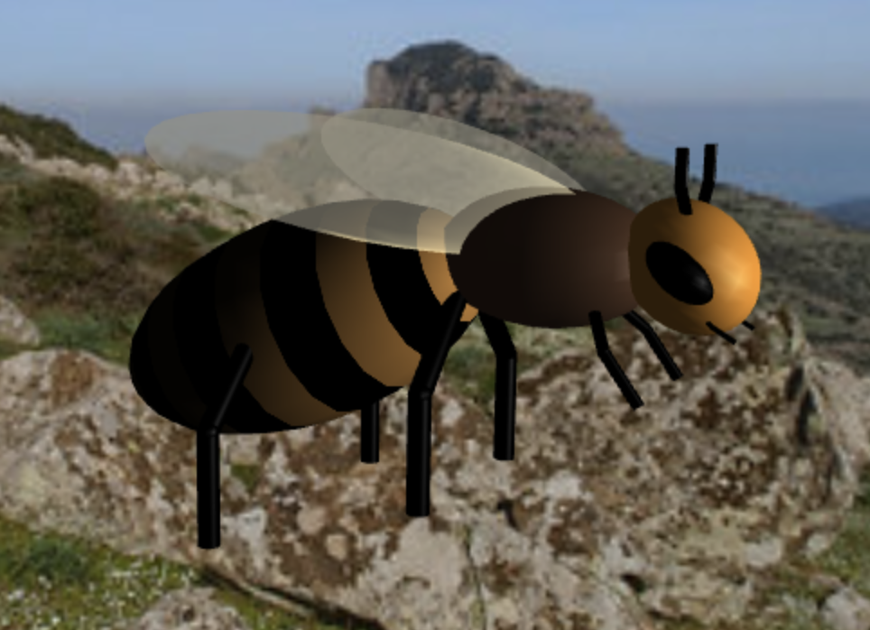

# CG 2023/2024

## Group T06G09

## Project Notes

- For the 1.1 topic we didn't have much difficulties and we did all that was asked and additionally we firstly defined a tag but now we changed it because we had a little bug on the outter loops.

- For the 1.2 topic we didn't have much difficulties and we did all that was asked, we also implemented a fov slider and we provided two screenshots to better show the panorama with different fov settings.

- For the 4.1 topic we did all that was asked, the two challenging parts were to apply a bee pattern texture to the abdomen of the bee because we needed to change the way we did the abdomen so the poles of the sphere where on the horizontal and not on the vertical, and the other challenging part was to make the wings "semi-transparent" because we were using alpha values too high and when we lowered we achieved what we wanted.

### Topic 1.1

### Topic 1.2

### Topic 2.1

### Topic 4.1

