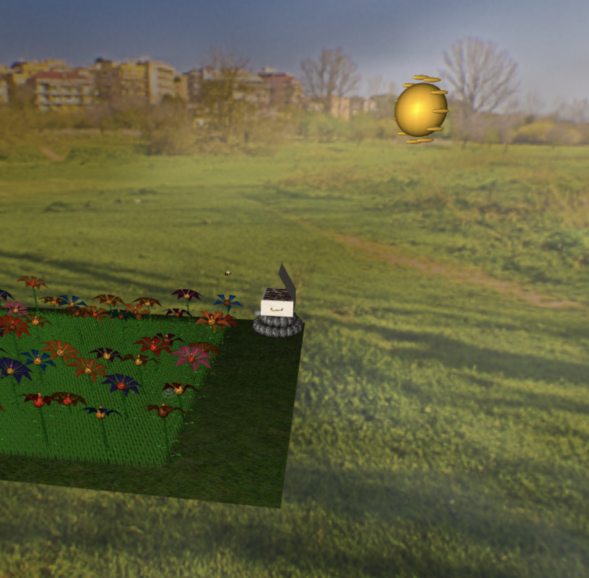

# CG 2023/2024

## Group T06G09

| Name             | Number    | E-Mail             |
| ---------------- | --------- | ------------------ |
| João Sousa       | 202106996 | up202106996@up.pt  |
| João Martins     | 202108723 | up202108723@up.pt  |

## Project Notes

- For the 1.1 topic we didn't have much difficulties and we did all that was asked and additionally we firstly defined a tag but now we changed it because we had a little bug on the outter loops.

- For the 1.2 topic we didn't have much difficulties and we did all that was asked, we also implemented a fov slider and we provided two screenshots to better show the panorama with different fov settings.

- For topic 2 we created the flower and then the garden with randomness and diversity. We applied some textures to the heart/leaves/stem/petals. And the only part we had some difficulties was the curving of the stem that we managed to resolve and then we had trouble putting the leafs in position with the stem curved but we resolved it too. In the end we also added more colors to the petals making the garden look more random and diverse. (there are 2 screenshots one with the flower individually and the other is the garden) (while doing grass topic changed how the textures are loaded for each flower in the garden so they are only loaded once and not 60+ times affecting performance) (in a final inspection we noticed we were not using a random leaf size and stem radius so we fixed that now)

- For the 3 topic we did all that was asked, but we had some difficulties those being when defining the rock there was a part that could be seen through and we corrected by applying a constant noise (deformation) to the first and last slice.

- For the 4.1 topic we did all that was asked, the two challenging parts were to apply a bee pattern texture to the abdomen of the bee because we needed to change the way we did the abdomen so the poles of the sphere where on the horizontal and not on the vertical, and the other challenging part was to make the wings "semi-transparent" because we were using alpha values too high and when we lowered we achieved what we wanted. (additionally while doing topic 6 we decided to add a stinger to the bee)

- For the 4.3 topic we did all that was asked. We had some difficulties along the completion of this task such as when there is no input acceleration but there is speed and when we turned the bee it continued to head on the last orientation and not the new one but we could fix this and other minor problems.

- For topic 5 we did the pollen and a modern beehive shaped like a box. We had a problem with lighting but we fixed it changing the normals of the quad primitive. This topic asked to put the hive above the rock pile but since we have a singular rock on top we overlapped the hive with it making the hive stand on a base of 4 rocks to be more realistic. Additionally to the box shaped hive we added a cover and 2 handles to the hive. Made the bee able to descend either to the flower if any below (in a threshold of 3 units of distance on both X and Z) or to the floor (corresponds to y = -2 because of how the bee is designed). For the descending we had a problem because of the scaling of the bee but we managed to overcome it. We had troubles again with scaling of the polen but we solved it easily by adding it to the secondary display of the bee if it was picked up. The bee is able to take the pollen to the hive it is taking horizontal lines on x and z for now but maybe on additional developments (if we have time) will parabolic descend into the hive and flower. (there are 2 screenshots one for each subtopic) (when doing the creativity part we found a "bug" that when the bee had already dropped a pollen on the hive it could go to the respective flower and get it back there and we fixed it by creating an additional array to keep track if the pollen had already been picked)

- For topic 6 we started by modeling the grass blade, first we used a set of already modelled triangles but later when implementing the shaders noticed this wouldnt work because the triangles didnt move the same way, destroying the shape of the grass blade. So we decided to define vertex by vertex creating the "triangular ribbons" and when using the shader we had success. One of the most challenging parts of this topic was managing performance, if we have a high number of blades per block the performance is going to run short so we decided to stick with 7 grass blades per block that are random height/width. We divided the grass into blocks and then displayed each block with a translation to increase performance but noticed we lost some of the randomness because all blocks will be the same but this proved to be crucial because otherwise the scene would be too "laggy". We also have the wind speed random. (if the scene is stuttering we would advise to decrease the number of blades per block in MyFlowerBed)

- For topic 7, we initiated the process of updating the panorama by incorporating cloud shaders. This involved adjusting the alpha values to be more transparent, allowing the underlying normal panorama to remain visible. By fine-tuning the alpha settings, we achieved a seamless integration of the cloud effects with the existing panorama, enhancing the overall visual depth and realism.

- For the creativity and last part of the project we combined most of the objects on the scene, we created a sun and added a variable number of rock piles on the scene. Moved the light near to the sun to give the impression that the sun is the light source.

### Topic 1.1

### Topic 1.2

### Topic 2

### Topic 3

### Topic 4.1

### Topic 4.3

### Topic 5

### Topic 6

### Topic 7

