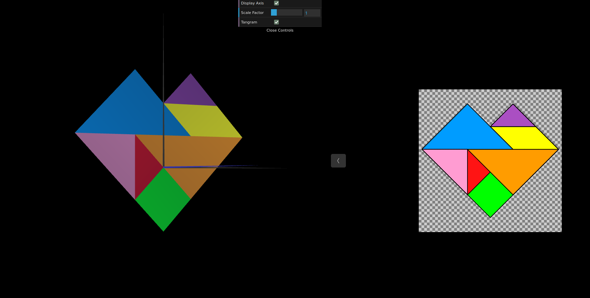
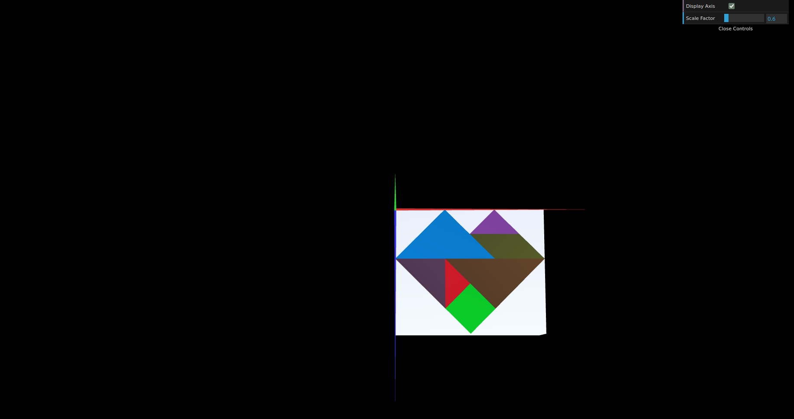

# CG 2023/2024

## Group T06G09

## TP 2 Notes

- In the first exercise we did the tangram atributed to our group, we worked with the figures from last tp overriding the display method on MyTangram and we applied translations, rotations and scalings to the figures in order to make the tangram. We also started using colors for each figure of the tangram. Overall we had no difficulties.

- We corrected the file MyTangram from last exercise to use 'multMatrix' for the diamond instead of 'translate'. In the second exercise we started by creating a cube and we moved the tangram slightly in front of the cube, so it would be visible. Then we applied both a translation and a rotation to both the tangram and the cube so they would be parallel to the XZ axis. Overall we had no difficulties.

