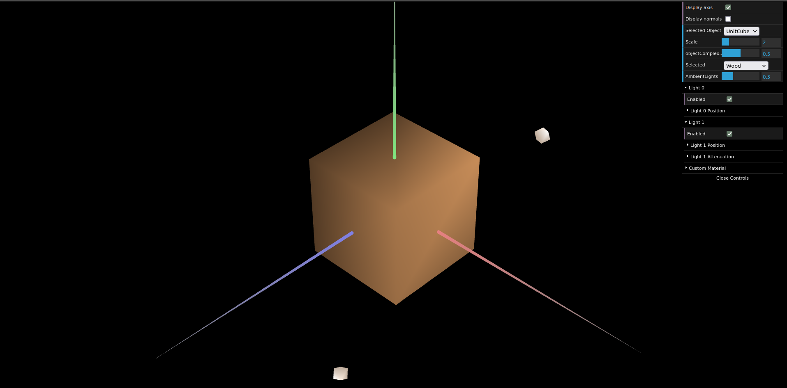
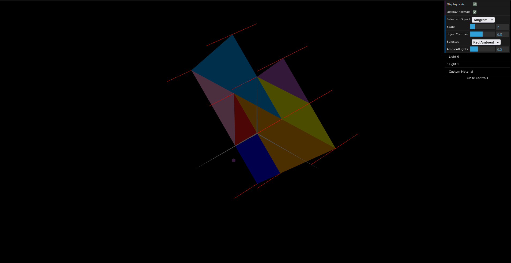

# CG 2023/2024

## Group T06G09

## TP 3 Notes

- In the first exercise we started by creating a new material (wood) and applying it to the cube. We had some trouble with the indices of the cube because of how we defined them in the last tp but we changed them and it worked. After that we created materials for each piece on the tangram and we did the normals for each one too.

