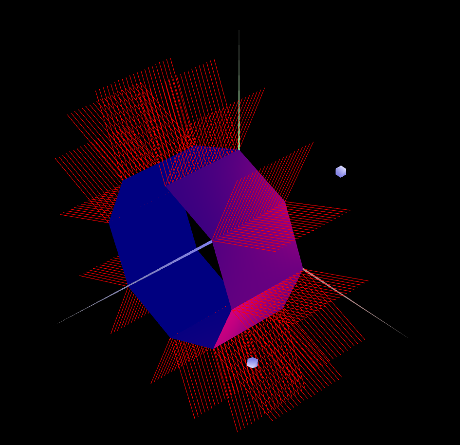
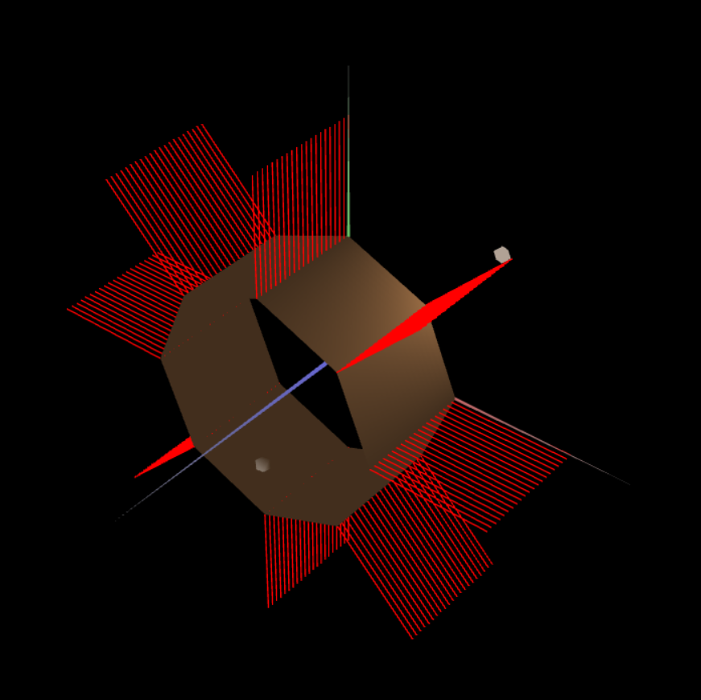

# CG 2023/2024

## Group T06G09

## TP 3 Notes

- In the first exercise we started by creating a new material (wood) and applying it to the cube. We had some trouble with the indices of the cube because of how we defined them in the last tp but we changed them and it worked. After that we created materials for each piece on the tangram and we did the normals for each one too.

- In the second exercise, we implemented a double-sided prism with configurable slices (sides) and stacks, defining four triangles per side. We also calculated and assigned the normals for each vertex.

- In the third exercise, we refined our prism implementation by eliminating double vertices, ensuring each vertex now has a single normal. Despite this enhancement, we maintained its double-sided nature. The entire process was smooth, and we encountered no challenges.

