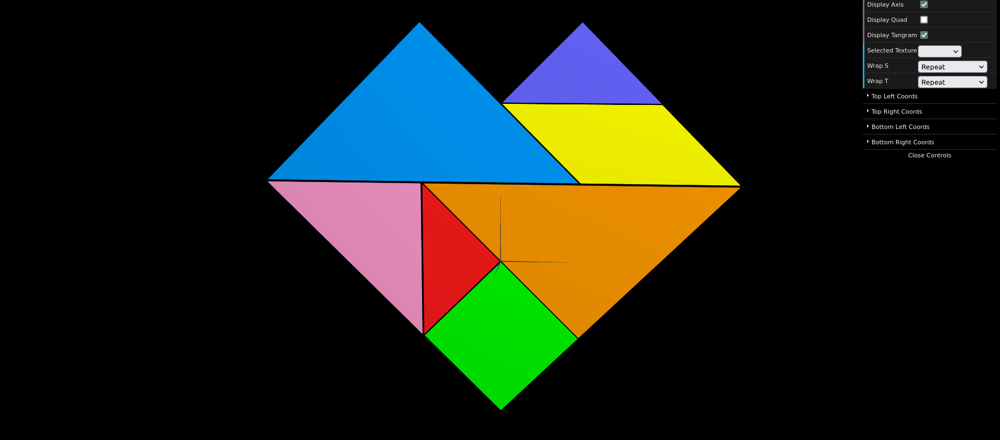

# CG 2023/2024

## Group T06G09

## TP 4 Notes

- In exercise 1, we mapped the texture tangram.png onto each vertex of each polygon in the figure. The part where we had most difficulties was when we had more than one polygon and how we would define the texture coordinates for each. We resolved this problem by using a "flag" (checker) to have different texture coordinates for each polygon.

