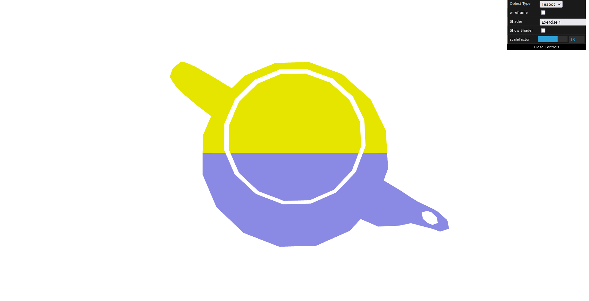
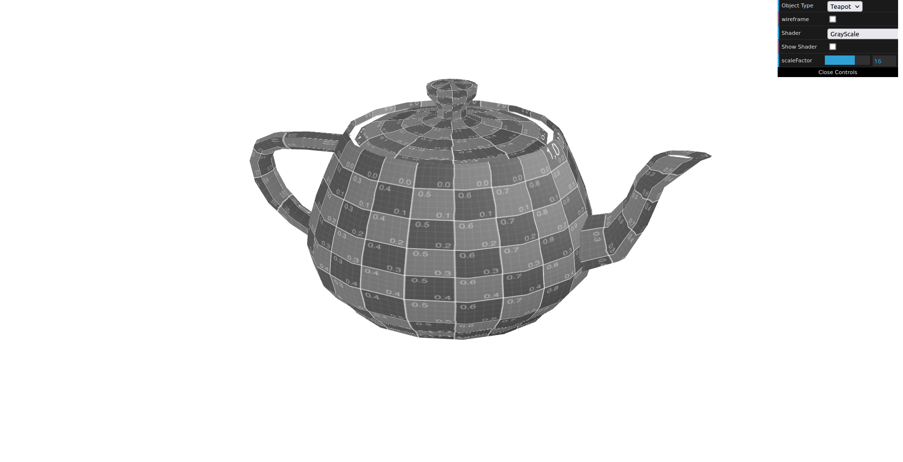

# CG 2023/2024

## Group T06G09

## TP 5 Notes

- In exercise 1, we started by copying flat vertex/fragment shaders and working over it creating a varying variable that would get the y coordinate of gl_position on the vertex shader and passing it to the fragment shader where we did an ifelse to check if y was greater than 0.5 and if it was we would display the yellow color otherwise display the blue color. After that we created a back-and-forth translation effect using the hint that was given. To finish exercise 1 we created a fragment shader (grayscale.frag) based on sepia and converted the color to grayscale according to the indications given.

