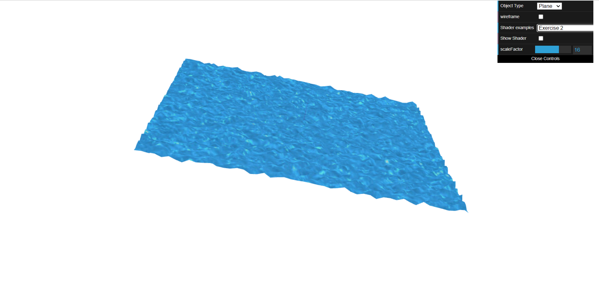

# CG 2023/2024

## Group T06G09

## TP 5 Notes

- In exercise 1, we started by copying flat vertex/fragment shaders and working over it creating a varying variable that would get the y coordinate of gl_position on the vertex shader and passing it to the fragment shader where we did an ifelse to check if y was greater than 0.5 and if it was we would display the yellow color otherwise display the blue color. After that we created a back-and-forth translation effect using the hint that was given. To finish exercise 1 we created a fragment shader (grayscale.frag) based on sepia and converted the color to grayscale according to the indications given.

- In exercise 2, we began by creating the files ex2.vert and ex2.frag inspired by texture2.vert and texture2.frag, with minor adjustments. One such adjustment was the creation of "timefactor," where the textures of the water changed with time.

